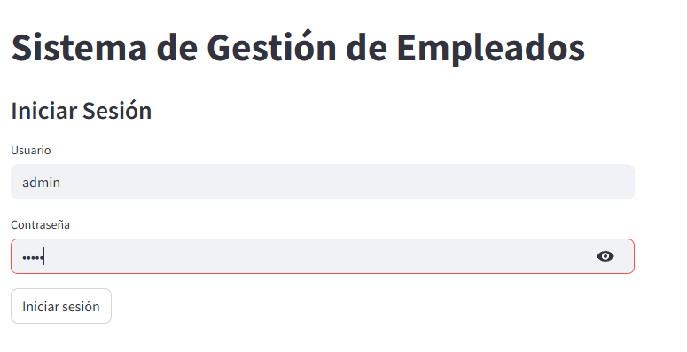
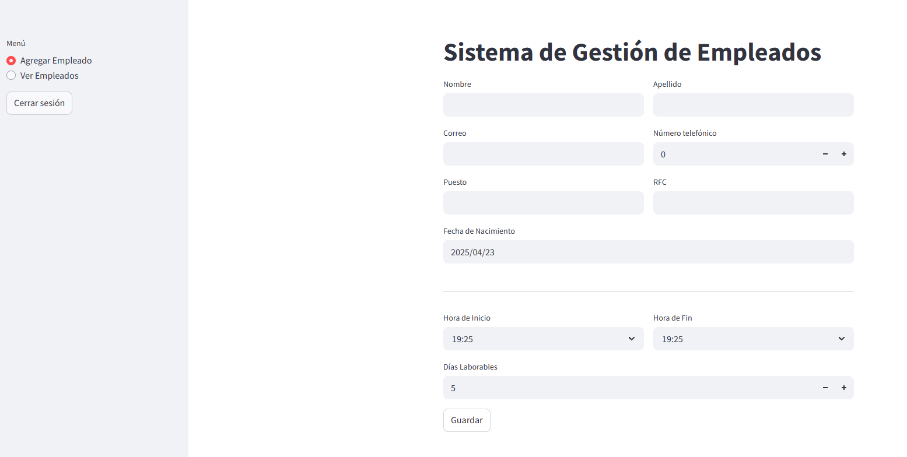
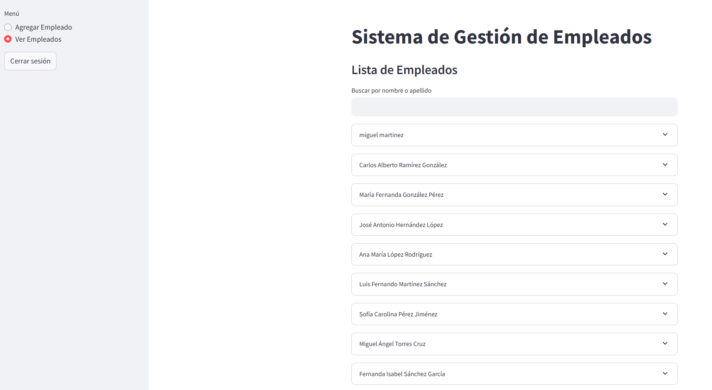
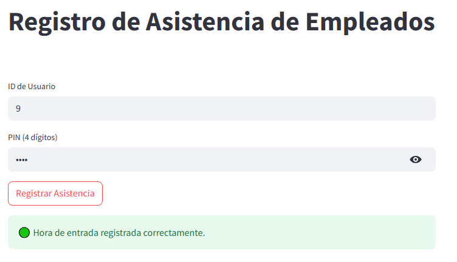
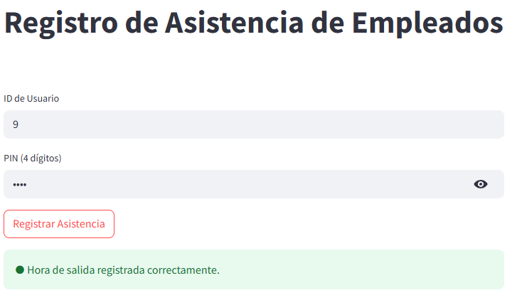
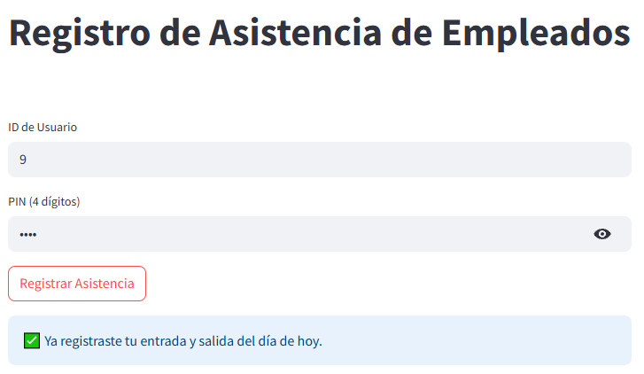

# Sistema-de-administraci-n
Proyecto de ingeniería en software para el desarrollo de un sistema de administración de empleados.
## 1. Configuración del Entorno Virtual
Primero, debes crear y activar un entorno virtual para aislar las dependencias del proyecto. 
Ejecuta los siguientes comandos en tu terminal **dentro de la carpeta** <span style="color:blue">`Sistema de administración`</span>:


1. **Crear un entorno virtual:**
    ```bash
    python -m venv venv
    ```

2. **Si estás en PowerShell, asegúrate de permitir la ejecución de scripts:**
    ```bash
    Set-ExecutionPolicy -ExecutionPolicy RemoteSigned -Scope CurrentUser
    ```

3. **Activar el entorno virtual:**
    ```bash
    .\venv\Scripts\activate
    ```


Al activar el entorno, verás que el prompt de la terminal cambia, indicando que estás trabajando dentro del entorno virtual.

## 2. Instalación de Librerías
Una vez que el entorno virtual esté activo, instala las librerías necesarias para ejecutar el asistente virtual. Es recomendable que las dependencias estén definidas en un archivo `requirements.txt`. Para instalar las librerías, ejecuta:

```bash
pip install -r requirements.txt
```
## 3. Importar la base de datos MySQL

Antes de ejecutar la aplicación, asegúrate de importar el archivo `empleados.sql` en tu servidor de base de datos MySQL. Este archivo contiene la estructura y los datos iniciales necesarios para que el sistema funcione correctamente.

## 4. Ejecutar la aplicación Streamlit

Una vez configurado el entorno y la base de datos, ejecuta la aplicación correspondiente según el tipo de usuario:

- **Si deseas ejecutar la aplicación donde los empleados solo registran su asistencia, ejecuta**:

```bash
streamlit run app_registro.py
```
Esta aplicación utiliza el script `funciones_registro.py`, que contiene la conexión a la base de datos y las funciones necesarias para validar el PIN del empleado y registrar su asistencia.

- **Si deseas ejecutar la aplicación del administrador, donde puedes crear nuevos usuarios, eliminarlos y editarlos, ejecuta**:

```bash
streamlit run app.py
```
Esta aplicación depende del script `funciones.py`, que contiene la lógica de conexión a la base de datos y las funciones necesarias para gestionar los empleados.


# Descripción de las páginas de la aplicación

## Página de Administrador

1. **Inicio de sesión del Administrador**
   - La primera imagen muestra la página de inicio de sesión del administrador, donde se ingresan las credenciales de usuario y contraseña. En este caso, el usuario es **"admin"** y la contraseña es **"admin"**.
   

2. **Agregar Nuevos Trabajadores**
   - La siguiente página permite al administrador agregar nuevos trabajadores al sistema. En ella, se pueden ingresar los datos necesarios para registrar un nuevo empleado.
   

3. **Buscar, Cambiar o Eliminar Datos de Empleados**
   - Esta página permite buscar a los empleados registrados y modificar sus datos o eliminarlos del sistema según sea necesario.
   

## Página de Registro

1. **Registro de un Usuario (Primer Registro del Día)**
   - La primera imagen muestra cómo se ve la página cuando un usuario se registra por primera vez en el día. Aquí, el sistema registra la entrada del usuario en el trabajo.
   

2. **Registro de un Usuario (Segundo Registro del Día)**
   - La segunda imagen muestra el caso en que el usuario se ha registrado dos veces en el día, es decir, realizó tanto su entrada como su salida.
   

3. **Imposibilidad de Registrar una Salida Duplicada**
   - La tercera imagen muestra que el sistema no permite que el usuario registre una salida si ya ha marcado su registro de salida previamente. Esto evita registros duplicados.
   

